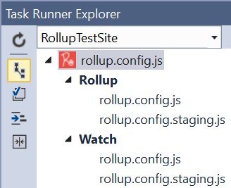
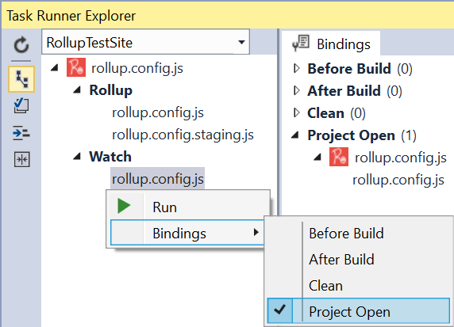

# Rollup Task Runner

<!-- Update the VS Gallery link after you upload the VSIX-->
Download this extension from the [VS Gallery](https://visualstudiogallery.msdn.microsoft.com/[GuidFromGallery])
or get the [CI build](http://vsixgallery.com/extension/356dbaea-0513-4de0-8343-822a753e771b/).

---------------------------------------

Task Runner Explorer support for 
Rollup.js - The next generation JavaScript module bundler.

See the [change log](CHANGELOG.md) for changes and road map.

## Prerequisites
Make sure that Rollup.js is installed globally using npm:

> npm install rollup -g

That's all the requirements needed to use this extension.

## Features

- Task Runner Explorer integration
- Bindings to Visual Studio events supported
- Various CLI switches supported
- Requires rollup.config.js file in root of project or solution

### Task Runner Explorer
When a project or solution contains a file named *rollup.config.js*,
the Task Runner Explorer will load the relevant Rollup.js tasks:

If it finds other configuration files starting with *rollup.config.*
in the same directory as *rollup.config.js* then it will display
each of those files under each task node.

This allows you to run the tasks for a particular configuration file.

### Event bindings
Any task can be associated with a Visual Studio event, such as
*Project Open*. Simply right-click a task in Task Runner Explorer
to set the bindings.

#### CLI switches
On the left side of Task Runner Explorer, buttons are present to apply
switches to the commands. The switches are:

**Sourcemap** - Generates sourcemap files (`--sourcemap`)

**Disable use strict** - Disables "use strict" (`--no-strict`)

**Disable indentation** - No indentation in generated code (`--no-indent`)

**NoConflict** - Generates a NoConflict method for UMD globals (`--no-conflict`)

## Contribute
Check out the [contribution guidelines](.github/CONTRIBUTING.md)
if you want to contribute to this project.

For cloning and building this project yourself, make sure
to install the
[Extensibility Tools 2015](https://visualstudiogallery.msdn.microsoft.com/ab39a092-1343-46e2-b0f1-6a3f91155aa6)
extension for Visual Studio which enables some features
used by this project.

## License
[Apache 2.0](LICENSE)